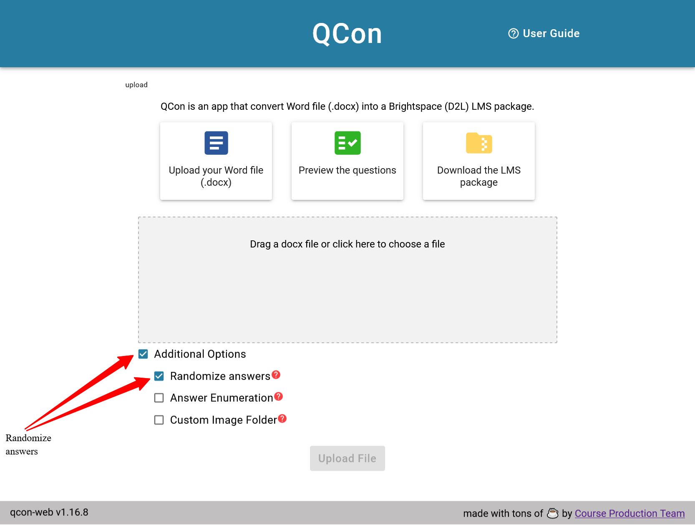

---
hide:
    - toc
---

# Randomizing answer options

!!! info inline end "Question randomization"

    | Question type | Randomized |
    |:-------------:|:----------:|
    |       MC      | :fontawesome-solid-check:{ .green .larger } or :fontawesome-solid-xmark:{ .red .larger } |
    |       MC      | :fontawesome-solid-check:{ .green .larger } or :fontawesome-solid-xmark:{ .red .larger } |
    |       TF      | :fontawesome-solid-xmark:{ .red .larger }                                                |
    |      FIB      | :fontawesome-solid-xmark:{ .red .larger }                                                |
    |       WR      | :fontawesome-solid-xmark:{ .red .larger }                                                |
    |      MAT      | :fontawesome-solid-check:{ .green .larger }                                              |
    |      ORD      | :fontawesome-solid-check:{ .green .larger }                                              |

Only Multiple Choice (MC) and Multiple-Select (MS) types can have randomized answer options. You can choose to have the answers from all these question types randomized or only individual questions that you specify.

!!! note

    - True/False (TF) and Written Response (WR) are **never** randomized
    - Matching (MAT) and Ordering (ORD) question types are **always** randomized

=== "All questions"

    Check the **Randomize all** option on the *Upload a File* page.

    { width="450" }

=== "Individual questions"

    Include the text **`Randomize: true`** above the question text.

        Randomize: true

        1. When is Labour Day celebrated each year?
            a. The first Monday in August
            b. The second Monday in October
            c. *The first Monday in September
            d. The third Monday of May
