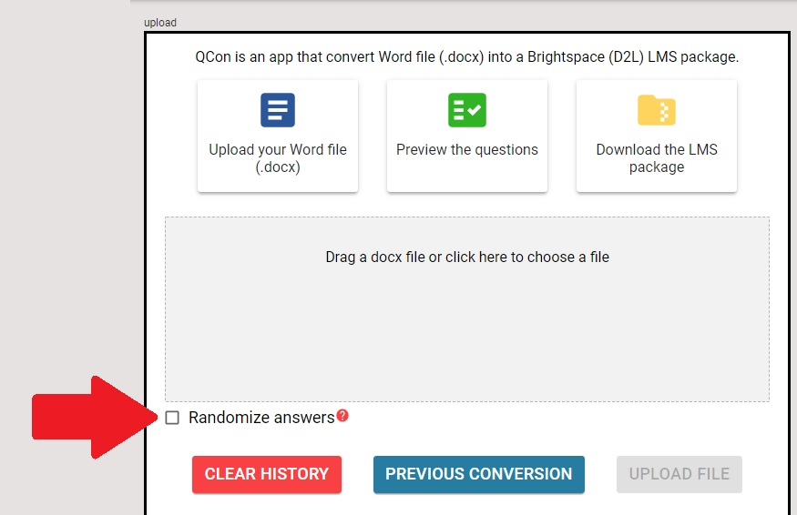

---
hide:
    - toc
---

# Randomizing answer options

!!! info inline end "Question randomization"

    | Question Type | Randomized |
    |:-------------:|:----------:|
    |       MC      |   ✔️ or ❌   |
    |       MS      |   ✔️ or ❌   |
    |       TF      |     ❌      |
    |      FIB      |     ❌      |
    |       WR      |     ❌      |
    |      MAT      |     ✔️      |
    |      ORD      |     ✔️      |

Only Multiple Choice (MC) and Multiple-Select (MS) types have **optional** randomized answer options.

You can choose to have the answers for these question types randomized or only the individual questions that you specify.

!!! note

    - True/False (TF) and Written Response (WR) are **never** randomized
    - Matching (MAT) and Ordering (ORD) question types are **always** randomized

=== "All questions"

    Check the **Randomize all** checkbox on the *Upload File* page.

    { width="450" }

=== "Individual questions"

    Include the text **`Randomize: true`** above the question text.

        Randomize: true

        1. When is Labour Day celebrated each year?
            a. The first Monday in August
            b. The second Monday in October
            c. *The first Monday in September
            d. The third Monday of May
