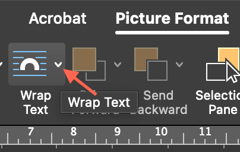
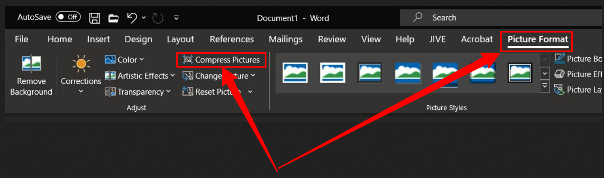
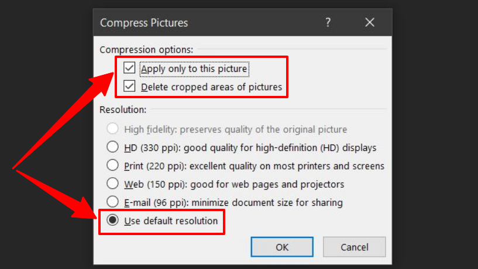

---
hide:
    - toc
---

# Media & Links

## Images

!!! tip inline end "Wrap text for images"

    1. { align=right }
    1. { align=right }

Images can be added to question text, answer text, or feedback.

!!! note "Note"

    Images should have the *Wrap text* format option set to *In Line with Text*.

To position an image correctly:

1. Select the image
1. Choose **Picture Format** at the top of the ribbon
1. Choose **Wrap Text**
1. Choose **In Line with Text**

If your image changes location after completing the steps above, reposition the image by dragging it to where you want it.

If you use the editing tools in Word to crop or resize an image, you have to compress the image or it will show the uncropped or resized version of the image. Do the following to compress the image:

1. Select/click the image on the Word document
1. Once you're in the **Picture Format** tab, click on the Compress Pictures button
    
1. In the **Compress Pictures** dialog box, select the **Apply only to this picture**, **Delete cropped areas of pictures**, and **use default resolution** options
    
1. Click **OK**

## Videos

Currently, QCon doesn't accept embedded videos. Please either add a link to a video or add embedded videos after the questions have been imported into your LMS.

## Web Links

QCon automatically converts Word hyperlinks into web links.
