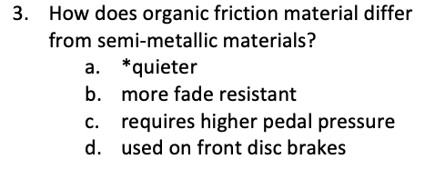
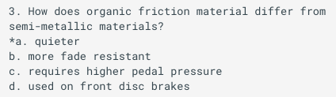
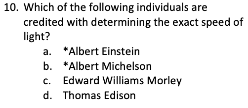
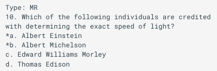
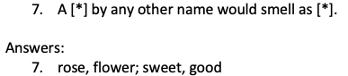
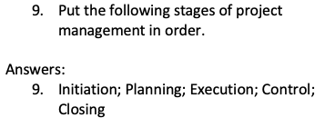

---
hide:
    - toc
---

# Migrating from Respondus

Qcon improves upon Respondus in two important ways:

- **it is web-based**, which makes it available to everyone, not just those who run Windows
- **correct answers have the asterisk *after* the list number**

Qcon has other benefits like *answer key* answers for FIB, MAT, and ORD-type questions and no **Type: ...** requirements, but we'll stop there and let you discover Qcon's usefulness at your own pace!

Here are some examples of the differences between Qcon and Respondus:

## Multiple Choice (MC)

| Qcon | Respondus |
|:-------------:|:----------:|
{ width="300" } | **only available when using plain text or *answer key*** { width="300" } |

## Multiple Select (MS)

| Qcon | Respondus |
|:-------------:|:----------:|
{ width="300" } | **only available when using plain text or answer key** { width="300" } |

## Fill-in-blank (FIB)

| Qcon | Respondus |
|:-------------:|:----------:|
{ width="310" } | **only available inline** |

## Ordering (ORD)

| Qcon | Respondus |
|:-------------:|:----------:|
{ width="310" } | **only available inline** |

## Question Type Differences

Migrating from Respondus may involve reviewing your documents for the question type codes that are used. Qcon uses slightly different lettering as outlined in the table below:

|    Question Type   | QCon | Respondus |
|:-------------------|:----:|:---------:|
| Written Response   |  WR  | **E**     |
| Fill-in the Blanks |  FIB | **FMB**   |
| Multi-Select       |  MS  | **MR**    |
| Matching           |  MAT | **MT**    |
| Ordering           |  ORD | ORD       |
| Multiple Choice    |  MC  | MC        |
| True/False         |  TF  | TF        |
