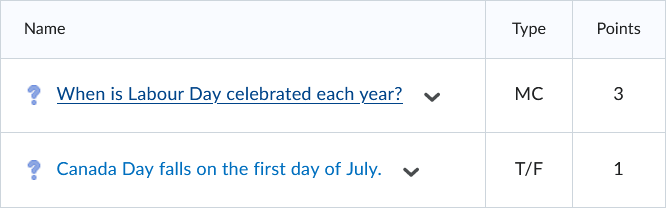

# Points

Questions can have various point values.

!!! info

    The default point value is 1.

!!! note

    - add the text **`Points:`** above the question text with the desired point value

=== "Text"

    !!! quote ""

        { width="620" }

=== "Output"

    === "Brightspace D2L"

        !!! quote ""

            { width="320" }
<!-- 
    === "Canvas"

        !!! quote ""

            Coming Soon.

    === "Moodle"

        !!! quote ""

            Coming Soon. -->
