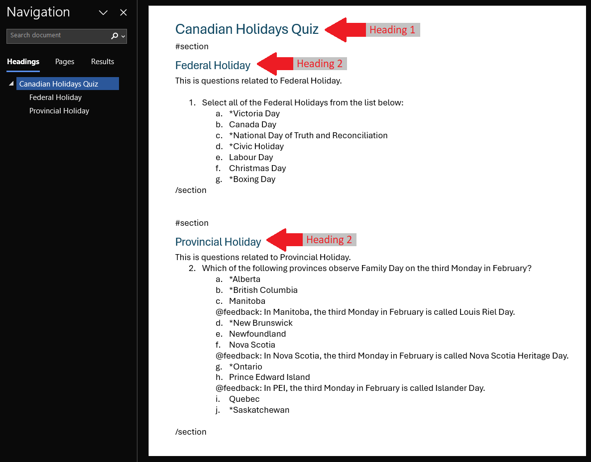
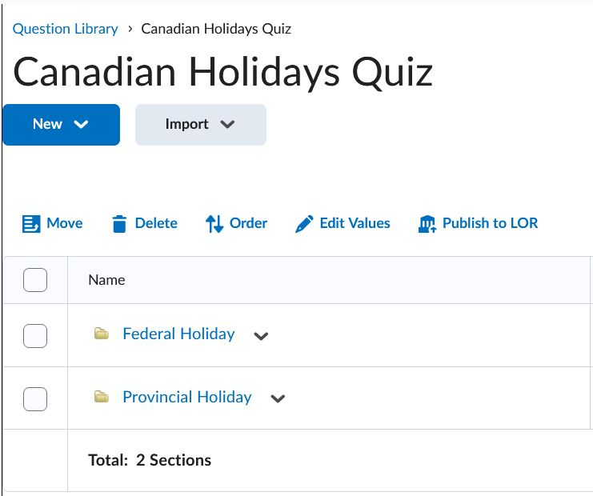

# Sections

Questions can be grouped into separate sections.

!!! note

    - start a new section with **`#section`**
    - end a section with **`/section`**
    - use Word headings to specify section names

=== "Text"

    !!! quote ""

        { width="620" }

=== "Output"

    === "Brightspace D2L"

        !!! quote ""

            { width="320" }
<!-- 
    === "Canvas"

        !!! quote ""

            Coming Soon.

    === "Moodle"

        !!! quote ""

            Coming Soon. -->
