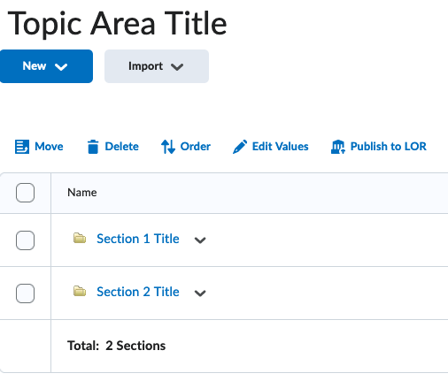

---
hide:
    - toc
---
# Sections

Questions can be grouped into separate sections through the use of `#section` markers.

!!! note

    Use Word style headings to specify section names.

=== "Word document example"

    { width="620" }

=== "Sections output example"

    { width="320" }
