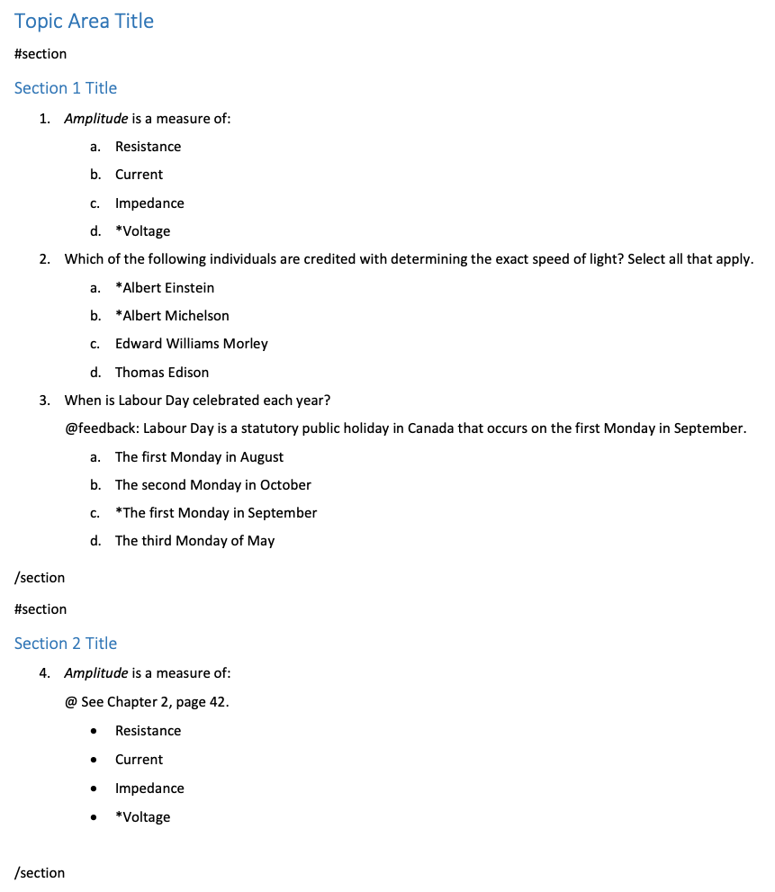
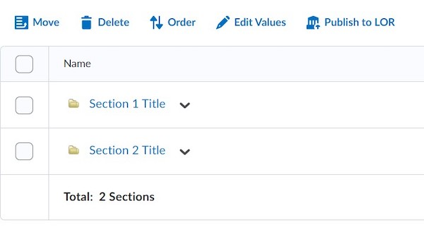

# Sections

Questions can be grouped into separate sections through the use of `#section` markers.

!!! note

    Use Word style headings to specify the name of the section.

Your Word document could look like this:

The sections in your LMS would look something like this:

{ width="450" }
