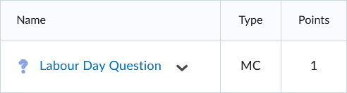

<!-- markdownlint-disable MD025 -->
# Question Titles / Short Descriptions

Questions titles or *short descriptions* are text fields that help identify similarly worded questions.

Titles are only displayed in the question library which makes them an ideal place to add administrative information like reference codes or subject groupings.

!!! note

    - add the text **`Title:`** above the question text with the desired description

=== "Text"
        Title: Labour Day Question
        1. When is Labour Day celebrated each year?
            a. The first Monday in August
            b. The second Monday in October
            c. *The first Monday in September
            d. The third Monday of May

=== "Output"

    === "Brightspace D2L"

        !!! quote ""

            
<!-- 
    === "Canvas"

        !!! quote ""

            Coming Soon.

    === "Moodle"

        !!! quote ""

            Coming Soon. -->
