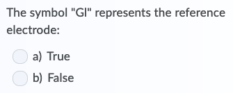
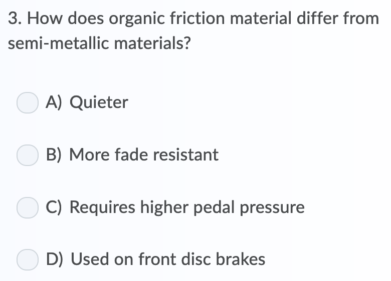
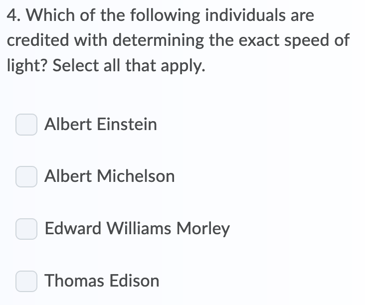
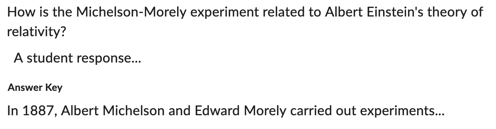
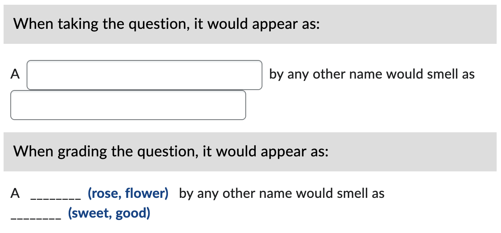
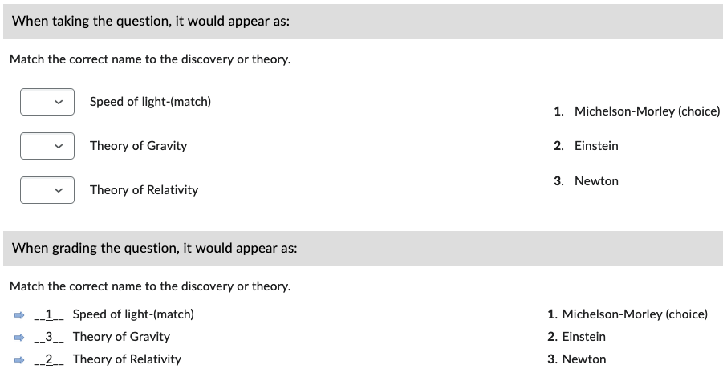

<!-- markdownlint-disable MD025 -->
# Basic Question Types with *Inline* Answers

The examples below represent straight-forward versions of each question type with the correct answer(s) indicated.

Additional options and question type details are available through the links in the navigation menu.

## True/False (TF)

=== "Text"

        2. The symbol "Gl" represents the reference electrode:
            a. True
            b. *False

=== "Output"

    { width="280" }

## Multiple Choice (MC)

=== "Text"

        3. How does organic friction material differ from semi-metallic materials?
            a. *Quieter
            b. More fade resistant
            c. Requires higher pedal pressure
            d. Used on front disc brakes

=== "Output"

    { width="280" }

## Multi-Select (MS)

=== "Text"

        4. Which of the following individuals are credited with determining the exact speed of light? Select all that apply.
            a. *Albert Einstein
            b. *Albert Michelson
            c. Edward Williams Morley
            d. Thomas Edison

=== "Output"

    { width="280" }

## Written Response/Long-Answer/Essay (WR)

=== "Text"

        5. How is the Michelson-Morely experiment related to Albert Einstein’s theory of relativity?
            a. In 1887, Albert Michelson and Edward Morely carried out experiments...

=== "Output"

    { width="555" }

## Fill-in-Blank (FIB)

For each word(s) that will be blank, use square brackets and then include all acceptable forms of the answers inside. Spelling counts! Case does not.

=== "Text"

        6. A [rose, flower] by any other name would smell as [sweet, good].

=== "Output"

    { width="475" }

## Matching (MAT)

List each matching pair in an ordered alpha list. Use an equals (=) sign flanked on each side by a space between each pair of matches:

=== "Text"

        7. Match the correct name to the discovery or theory.
            a. Michelson-Morely = Speed of light
            b. Einstein = Theory of Relativity
            c. Newton = Theory of Gravity

=== "Output"

    { width="505" }

## Ordering (ORD)

Use an ordered alpha list to arrange the answer options in the correct sequence:

=== "Text"

        8. Put the stages of project management in order.
            a. Initiation
            b. Planning
            c. Execution
            d. Control
            e. Closing

=== "Output"

    { width="350" }
