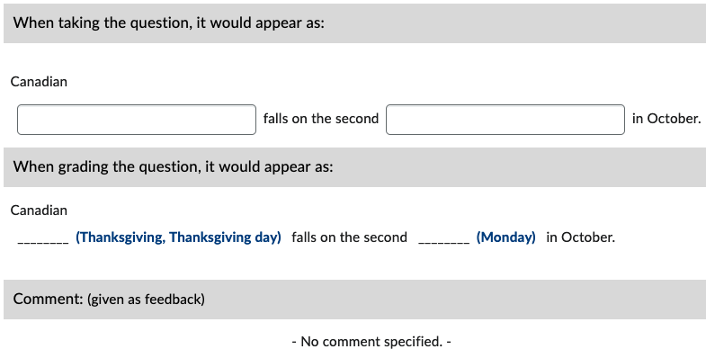
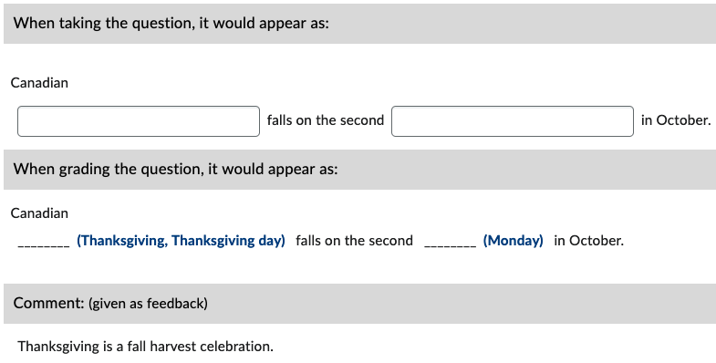

# Fill-in-Blanks (FIB)

For each word(s) that will be blank, use square brackets and then include all acceptable forms of the answers inside. Spelling counts! Case does not.

!!! note

    - Use a comma (**,**) to separate correct answers.

!!! abstract "Example Files"
    
    * [FIB_basic_examples.docx :fontawesome-regular-file-word:](../assets/example_files/FIB_basic_examples.docx)
    * [FIB_variation_examples.docx :fontawesome-regular-file-word:](../assets/example_files/FIB_variation_examples.docx)
    * [FIB_answer_key_examples.docx :fontawesome-regular-file-word:](../assets/example_files/FIB_answer_key_examples.docx)

## Basic example

=== "Text"

        1. Canadian [Thanksgiving, Thanksgiving day] falls on the second [Monday] in October.

=== "Output"

    === "Brightspace D2L"

        !!! quote ""
        
            
<!-- 
    === "Canvas"

        !!! quote ""

            Coming Soon.

    === "Moodle"

        !!! quote ""

            Coming Soon. -->

## With general feedback

=== "Text"

        1. Canadian [Thanksgiving, Thanksgiving day] falls on the second [Monday] in October.
            @feedback: Thanksgiving is a fall harvest celebration.

=== "Output"

    === "Brightspace D2L"

        !!! quote ""
        
            
<!-- 
    === "Canvas"

        !!! quote ""

            Coming Soon.

    === "Moodle"

        !!! quote ""

            Coming Soon. -->

<!-- markdownlint-disable MD033 -->
## With *answer key* [<small markdown>(info)</small>](../additional-info/end-answer-key.md)

!!! note

    **Question Text**

    - Use an asterisk enclosed in square brackets (**[*]**) to indicate a blank.

    **Answer Key Text**

    - Use a semicolon (**;**) to separate blanks.
    - Do **NOT** end the answer with a period (**.**) or it will be taken as part of the answer.

=== "Text"

        1. Canadian [*] falls on the second [*] in October.
        2. ...

        Answers:
            1. Thanksgiving, Thanksgiving day; Monday
            2. ...

=== "Output"

    === "Brightspace D2L"

        !!! quote ""

            
<!-- 
    === "Canvas"

        !!! quote ""

            Coming Soon.

    === "Moodle"

        !!! quote ""

            Coming Soon. -->
