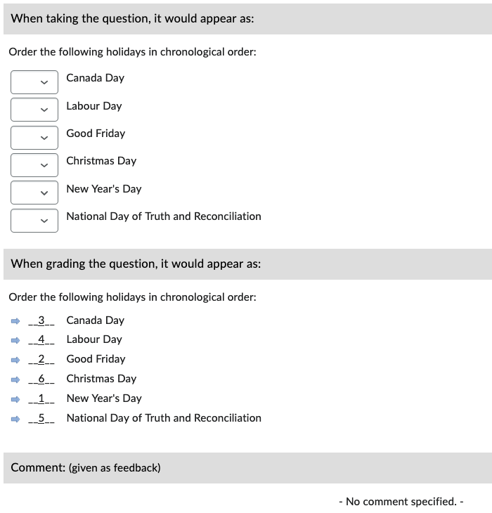
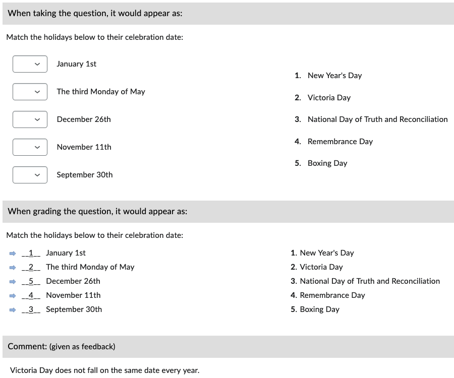

# Matching (MAT)

Matches are two terms separated by an equals sign (**=**).

!!! note

    - Answer options are **always** randomized
    - The default grading method is set to "All or nothing"; this can be changed manually (see [alternate methods](https://documentation.brightspace.com/EN/le/question_library/instructor/creating_questions.htm?tocpath=Instructors%7CAssess%20and%20grade%20learners%7CQuestion%20Library%7C_____1)) in the LMS.
    - Matches must have choices in a 1:1 ratio (blank choices can be added manually in the LMS).

!!! info
    Use the format:

        a. Choice 1 = Match 1
        b. Choice 2 = Match 2
        c. Choice 3 = Match 3

    <!-- *Choice 2 in this example is a blank (distractor)* -->

## Basic example

=== "Text"

        1. Match the holidays below to their celebration date:
            a. January 1st = New Year's Day
            b. The third Monday of May = Victoria Day
            c. September 30th = National Day of Truth and Reconciliation
            d. November 11th = Remembrance Day
            e. December 26th = Boxing Day

=== "Output"

    === "Brightspace D2L"

        !!! quote ""

            
<!-- 
    === "Canvas"

        !!! quote ""

            Coming Soon.

    === "Moodle"

        !!! quote ""

            Coming Soon. -->

## With general feedback

=== "Text"

        1. Match the holidays below to their celebration date:
            @feedback: Victoria Day does not fall on the same date every year.

            a. January 1st = New Year's Day
            b. The third Monday of May = Victoria Day
            c. September 30th = National Day of Truth and Reconciliation
            d. November 11th = Remembrance Day
            e. December 26th = Boxing Day

=== "Output"

    === "Brightspace D2L"

        !!! quote ""

            
<!-- 
    === "Canvas"

        !!! quote ""

            Coming Soon.

    === "Moodle"

        !!! quote ""

            Coming Soon. -->

<!-- markdownlint-disable MD033 -->
## With *answer key* [<small markdown>(info)</small>](../additional-info/end-answer-key.md)

!!! note

    - Use a semicolon (**;**) to separate matches.

=== "Text"

        1. Match the holidays below to their celebration date:
        2. ...

        Answers:
            1. January 1st = New Year's Day; The third Monday of May = Victoria Day; September 30th = National Day of Truth and Reconciliation; November 11th = Remembrance Day; December 26th = Boxing Day
            2. ...

=== "Output"

    === "Brightspace D2L"

        !!! quote ""

            
<!-- 
    === "Canvas"

        !!! quote ""

            Coming Soon.

    === "Moodle"

        !!! quote ""

            Coming Soon. -->

## Special cases

??? note "Equals sign (=) is within the choice/match"

    If part of a choice or match contains an equals sign (**=**) you can use *double equals signs* (**`==`**) to separate correct matches.

        1. Match the correct statements:
            a. 3 + 2 = 5 == Correct
            b. 2 + 2 = 5 == Incorrect
            c. ...
