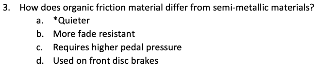
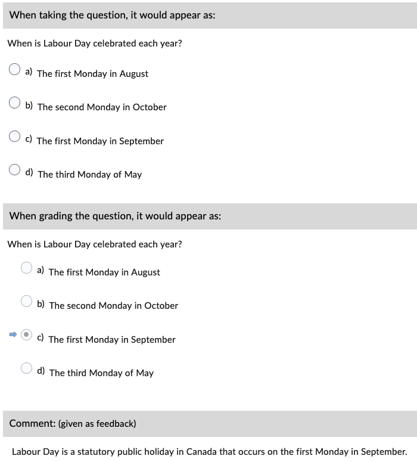
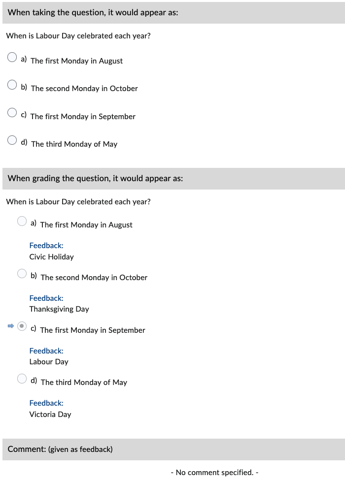

# Multiple Choice (MC)

Correct answers are specified *inline* with an asterisk (*****).

!!! note

    If more than one correct answer is specified, the question becomes a Multiple-Select type.

## Basic example

=== "Text"

        1. When is Labour Day celebrated each year?
            a. The first Monday in August
            b. The second Monday in October
            c. *The first Monday in September
            d. The third Monday of May

=== "Output"

    === "Brightspace D2L"

        !!! quote ""
        
            
<!-- 
    === "Canvas"

        !!! quote ""

            Coming Soon.

    === "Moodle"

        !!! quote ""

            Coming Soon. -->

## With general feedback

=== "Text"

        1. When is Labour Day celebrated each year?
            @feedback: Labour Day is a statutory public holiday in Canada that occurs on the first Monday in September.

            a. The first Monday in August
            b. The second Monday in October
            c. *The first Monday in September
            d. The third Monday of May

=== "Output"

    === "Brightspace D2L"

        !!! quote ""
        
            
<!-- 
    === "Canvas"

        !!! quote ""

            Coming Soon.

    === "Moodle"

        !!! quote ""

            Coming Soon. -->

## With option-specific feedback

=== "Text"

        1. When is Labour Day celebrated each year?

            a. The first Monday in August
            @feedback: Civic Holiday

            b. The second Monday in October
            @feedback: Thanksgiving Day

            c. *The first Monday in September
            @feedback: Labour Day

            d. The third Monday of May
            @feedback: Victoria Day

=== "Output"

    === "Brightspace D2L"

        !!! quote ""
        
            
<!-- 
    === "Canvas"

        !!! quote ""

            Coming Soon.

    === "Moodle"

        !!! quote ""

            Coming Soon. -->

<!-- markdownlint-disable MD033 -->
## With *answer key* [<small markdown>(info)</small>](../additional-info/end-answer-key.md)

!!! note

    Only include the correct option in the answer key, **NOT** the full text.

=== "Text"

        1. When is Labour Day celebrated each year?
            a. The first Monday in August
            b. The second Monday in October
            c. The first Monday in September
            d. The third Monday of May

        2. ...

        Answers:
            1. c
            2. ...

=== "Output"

    === "Brightspace D2L"

        !!! quote ""

            
<!-- 
    === "Canvas"

        !!! quote ""

            Coming Soon.

    === "Moodle"

        !!! quote ""

            Coming Soon. -->
