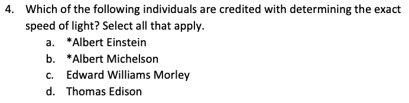
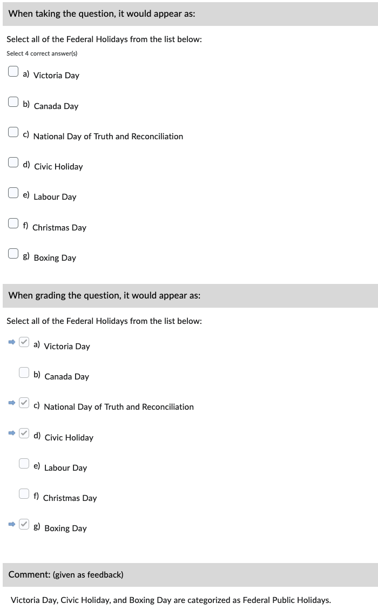
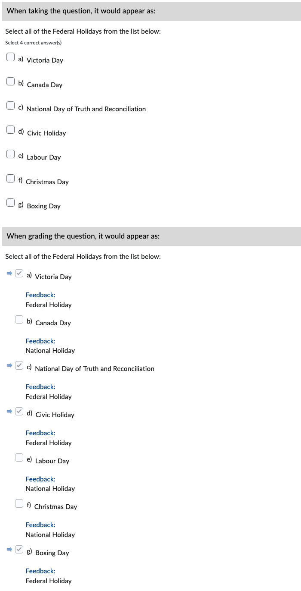

# Multiple-Select (MS)

Correct answers are specified *inline* with an asterisk (*****).

!!! note

    - If only one correct answer is specified, the question becomes a Multiple Choice type **unless** the text `"Type: MS"` is added before the question text.
    - The default grading method is set to "Correct Answers, Limited Selections"; this can be changed manually (see [alternate methods](https://documentation.brightspace.com/EN/le/question_library/instructor/creating_questions.htm?tocpath=Instructors%7CAssess%20and%20grade%20learners%7CQuestion%20Library%7C_____1)) in the LMS.

## Basic example

=== "Text"

        1. Select all of the Federal Holidays from the list below:
            a. *Victoria Day
            b. Canada Day
            c. *National Day of Truth and Reconciliation
            d. *Civic Holiday
            e. Labour Day
            f. Christmas Day
            g. *Boxing Day

=== "Output"

    === "Brightspace D2L"

        !!! quote ""

            
<!-- 
    === "Canvas"

        !!! quote ""

            Coming Soon.

    === "Moodle"

        !!! quote ""

            Coming Soon. -->

## With general feedback

=== "Text"

        1. Select all of the Federal Holidays from the list below:
            @feedback: Victoria Day, Civic Holiday, and Boxing Day are categorized as Federal Public Holidays.

            a. *Victoria Day
            b. Canada Day
            c. *National Day of Truth and Reconciliation
            d. *Civic Holiday
            e. Labour Day
            f. Christmas Day
            g. *Boxing Day

=== "Output"

    === "Brightspace D2L"

        !!! quote ""

            
<!-- 
    === "Canvas"

        !!! quote ""

            Coming Soon.

    === "Moodle"

        !!! quote ""

            Coming Soon. -->

## With option-specific feedback

=== "Text"

        1. Select all of the Federal Holidays from the list below:

            a. *Victoria Day
            @feedback: Federal Holiday

            b. Canada Day
            @feedback: National Holiday

            c. *National Day of Truth and Reconciliation
            @feedback: Federal Holiday

            d. *Civic Holiday
            @feedback: Federal Holiday

            e. Labour Day
            @feedback: National Holiday

            f. Christmas Day
            @feedback: National Holiday

            g. *Boxing Day
            @feedback: Federal Holiday

=== "Output"

    === "Brightspace D2L"

        !!! quote ""

            
<!-- 
    === "Canvas"

        !!! quote ""

            Coming Soon.

    === "Moodle"

        !!! quote ""

            Coming Soon. -->

<!-- markdownlint-disable MD033 -->
## With *answer key* [<small markdown>(info)</small>](../additional-info/end-answer-key.md)

!!! note

    - Use a comma (**,**) to separate the correct answers.
    - Only include the correct list items in the answer key, **NOT** the full text.

=== "Text"

        1. Select all of the Federal Holidays from the list below:
            a. *Victoria Day
            b. Canada Day
            c. *National Day of Truth and Reconciliation
            d. *Civic Holiday
            e. Labour Day
            f. Christmas Day
            g. *Boxing Day

        2. ...

        Answers:
            1. a, c, d, g
            2. ...

=== "Output"

    === "Brightspace D2L"

        !!! quote ""

            
<!-- 
    === "Canvas"

        !!! quote ""

            Coming Soon.

    === "Moodle"

        !!! quote ""

            Coming Soon. -->
