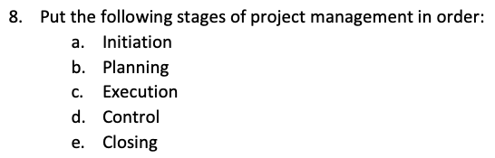
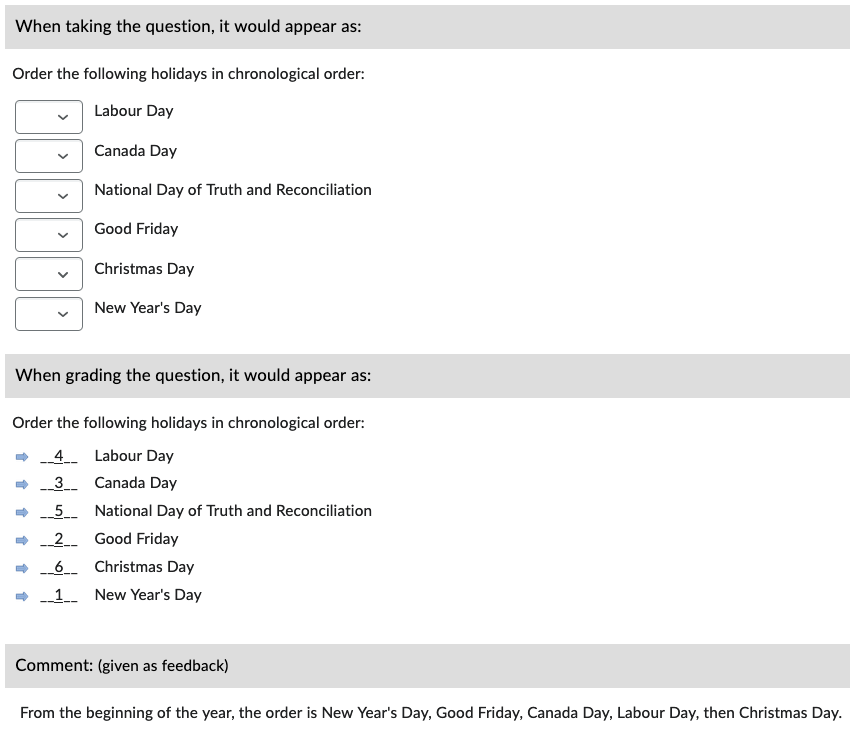

# Ordering (ORD)

An ordering question asks the participant to list terms in a correct sequence.

!!! note

    - Answer options are **always** randomized
    - The default grading method is set to "Correct answers"; this can be changed manually in the LMS.

## Basic example

=== "Text"

        1. Order the following holidays in chronological order:
            a. New Year's Day
            b. Good Friday
            c. Canada Day
            d. Labour Day
            e. National Day of Truth and Reconciliation
            f. Christmas Day

=== "Output"

    === "Brightspace D2L"

        !!! quote ""

            
<!-- 
    === "Canvas"

        !!! quote ""

            Coming Soon.

    === "Moodle"

        !!! quote ""

            Coming Soon. -->

## With general feedback

=== "Text"

        1. Order the following holidays in chronological order:
            @feedback: From the beginning of the year, the order is New Year's Day, Good Friday, Canada Day, Labour Day, then Christmas Day.

            a. New Year's Day
            b. Good Friday
            c. Canada Day
            d. Labour Day
            e. National Day of Truth and Reconciliation
            f. Christmas Day

=== "Output"

    === "Brightspace D2L"

        !!! quote ""

            
<!-- 
    === "Canvas"

        !!! quote ""

            Coming Soon.

    === "Moodle"

        !!! quote ""

            Coming Soon. -->

<!-- markdownlint-disable MD033 -->
## With *answer key* [<small markdown>(info)</small>](../additional-info/end-answer-key.md)

!!! note

    - Use a semicolon (**;**) to separate terms.
    - Do **NOT** end the answer with a period (**.**) or it will be taken as part of the answer.

=== "Text"

        1. Order the following holidays on a chronological order.
        2. ...

        Answers:
            1. New Year's Day; Good Friday; Canada Day; Labour Day; National Day of Truth and Reconciliation; Christmas Day
            2. ...

=== "Output"

    === "Brightspace D2L"

        !!! quote ""

            
<!-- 
    === "Canvas"

        !!! quote ""

            Coming Soon.

    === "Moodle"

        !!! quote ""

            Coming Soon. -->
