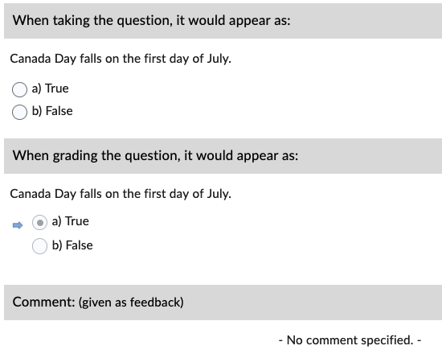
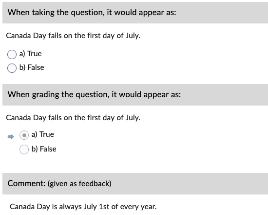
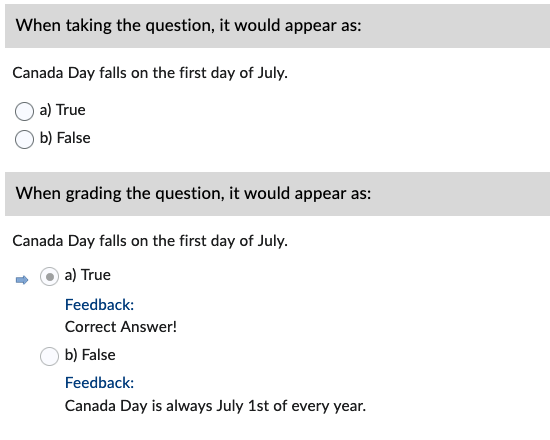

# True/False (TF)

Correct answers are specified *inline* with an asterisk (*****).

!!! note

    **Only use the words `True` and `False`** as answer options or the question becomes a Multiple Choice type.

## Basic example

=== "Text"

        1. Canada Day falls on the first day of July.
            a. *True
            b. False

=== "Output"

    === "Brightspace D2L"

        !!! quote ""
        
            
<!-- 
    === "Canvas"

        !!! quote ""

            Coming Soon.

    === "Moodle"

        !!! quote ""

            Coming Soon. -->

## With general feedback

=== "Text"

        1. Canada Day falls on the first day of July.
            @feedback: Canada Day is always July 1st of every year.
            
            a. *True
            b. False

=== "Output"

    === "Brightspace D2L"

        !!! quote ""
        
            
<!-- 
    === "Canvas"

        !!! quote ""

            Coming Soon.

    === "Moodle"

        !!! quote ""

            Coming Soon. -->

## With option-specific feedback

=== "Text"

        1. Canada Day falls on the first day of July.
            a. *True
            @feedback: Correct Answer!

            b. False
            @feedback: Canada Day is always July 1st of every year.

=== "Output"

    === "Brightspace D2L"

        !!! quote ""
        
            
<!-- 
    === "Canvas"

        !!! quote ""

            Coming Soon.

    === "Moodle"

        !!! quote ""

            Coming Soon. -->

<!-- markdownlint-disable MD033 -->
## With *answer key* [<small markdown>(info)</small>](../additional-info/end-answer-key.md)

!!! note

    Only include the correct option in the answer key, **NOT** the full text.

=== "Text"

        1. Canada Day falls on the first day of July.
            a. True
            b. False

        2. ...

        Answers:
            1. a
            2. ...

=== "Output"

    === "Brightspace D2L"

        !!! quote ""
        
            
<!-- 
    === "Canvas"

        !!! quote ""

            Coming Soon.

    === "Moodle"

        !!! quote ""

            Coming Soon. -->
