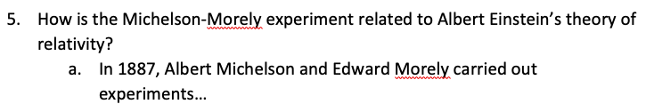
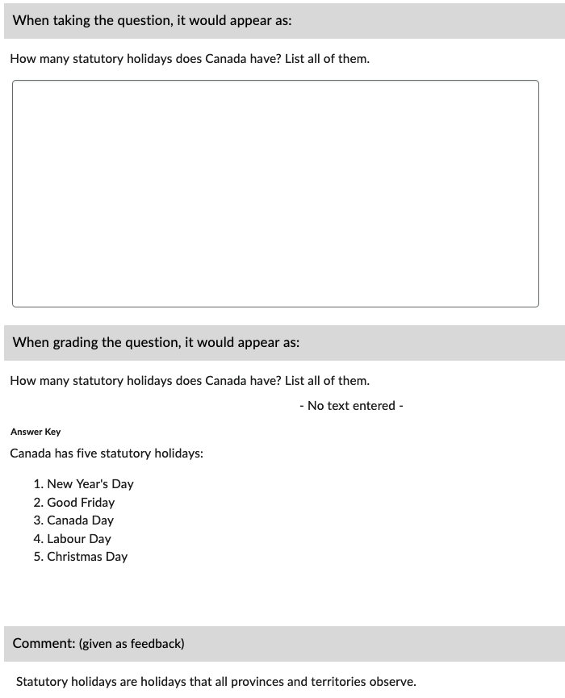

# Written Response (WR)

Written response type questions - also known as long answers or essays - ask the participant to submit paragraph-length responses.

## Basic example

!!! note

    Correct answers (grading/answer keys) are specified with the words "**Correct answer:**" between the question text and the answer.

=== "Text"

        1. How many statutory holidays does Canada have? List all of them.

            Correct answer:
            Canada has five statutory holidays:
                1. New Year's Day
                2. Good Friday
                3. Canada Day
                4. Labour Day
                5. Christmas Day

=== "Output"

    === "Brightspace D2L"

        !!! quote ""
        
            
<!-- 
    === "Canvas"

        !!! quote ""

            Coming Soon.

    === "Moodle"

        !!! quote ""

            Coming Soon. -->

## Basic example - Shorthand

!!! note

    - Only one list item (eg. **a. **) is accepted.
    - Ordered lists are not accepted in the answer key for the shorthand version.

=== "Text"

        1. How many statutory holidays does Canada have? List all of them.
            a. Canada has five statutory holidays: 1) New Year's Day, 2) Good Friday, 3) Canada Day, 4) Labour Day, 5) Christmas Day.

=== "Output"

    === "Brightspace D2L"

        !!! quote ""
        
            
<!-- 
    === "Canvas"

        !!! quote ""

            Coming Soon.

    === "Moodle"

        !!! quote ""

            Coming Soon. -->

## With general feedback

=== "Text"

        1. How many statutory holidays does Canada have? List all of them.
            @feedback: Statutory holidays are holidays that all provinces and territories observe.

            Correct answer:
            Canada has five statutory holidays:
                1. New Year's Day
                2. Good Friday
                3. Canada Day
                4. Labour Day
                5. Christmas Day

=== "Output"

    === "Brightspace D2L"

        !!! quote ""

            
<!-- 
    === "Canvas"

        !!! quote ""

            Coming Soon.

    === "Moodle"

        !!! quote ""

            Coming Soon. -->

<!-- markdownlint-disable MD033 -->
## With *answer key* [<small markdown>(info)</small>](../additional-info/end-answer-key.md)

!!! note

    - Ordered lists are not accepted in the answer key.

=== "Text"

        Type: WR

        1. How many statutory holidays does Canada have? List all of them.

        2. ...

        Answers:
            1. Canada has five statutory holidays: 1) New Year's Day, 2) Good Friday, 3) Canada Day, 4) Labour Day, 5) Christmas Day.
            2. ...

=== "Output"

    === "Brightspace D2L"

        !!! quote ""

            
<!-- 
    === "Canvas"

        !!! quote ""

            Coming Soon.

    === "Moodle"

        !!! quote ""

            Coming Soon. -->
