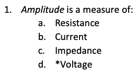

!!! info inline end ""

    <figure markdown>
    [https://qcon.ltc.bcit.ca](https://qcon.ltc.bcit.ca)
    </figure>

<!-- markdownlint-disable MD025 -->
# What is Qcon?

**Qcon is a conversion tool that makes it easy to manage online learning questions.**

<!-- markdownlint-disable MD033 -->
<figure markdown="1">

<figcaption>Write questions using Word and then upload them to a Learning Management System (LMS).</figcaption>
</figure>

Before using Qcon you’ll need to follow some simple formatting rules.

!!! note "Section headings"

    !!! info inline end ""

        If there is no **Heading 1** style then the filename will be used instead.

    The first heading in your document will be used as the section name in your question library.

!!! note "Question numbering"

    All questions should be numbered in sequence.

!!! note "Question format"

    !!! info inline end ""
    
        { width="180" }

    Questions should *begin with a number* followed by either a period (**.**) or a right parenthesis (**)**), a space, and then the question text.
    
    Use the Word *Numbering* list style for best results.

!!! note "Correct answers"

    !!! info inline end ""

        Correct answers are indicated with an asterisk (*****).

    Indicate your correct answers with an asterisk or in an answer key section at the end of the document.

    Asterisks should be before the answer text and after the period or parentheses.

!!! note "Answer numbering"

    !!! info inline end ""

        Answers should be lower-case or upper-case alphabet lists.

    Use ordered lists for the answer options.

    Start each answer option with a letter, then a period (**.**) or a right parenthesis (**)**), a space, and then the answer text.

!!! note "Ignored elements"

    Comments, subheadings, footers, and headers will be ignored.
