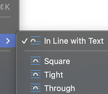

---
hide:
    - toc    
---

# Media & Links

## Images

!!! tip inline end "Embedding Images"

    { align=right }

Images can be added to questions as long as they are **In Line with Text**.

To position an image correctly:

1. Right click on the image
1. Click on "Wrap Text"
1. Click on "In Line with Text"

If your image changes location after completing the steps above, reposition the image by dragging it to where you want it.

## Videos

Currently, QCon doesn't accept embedded videos. Please add videos after the questions have been imported into your LMS.

## Web Links

QCon automatically converts Word hyperlinks into web links.
