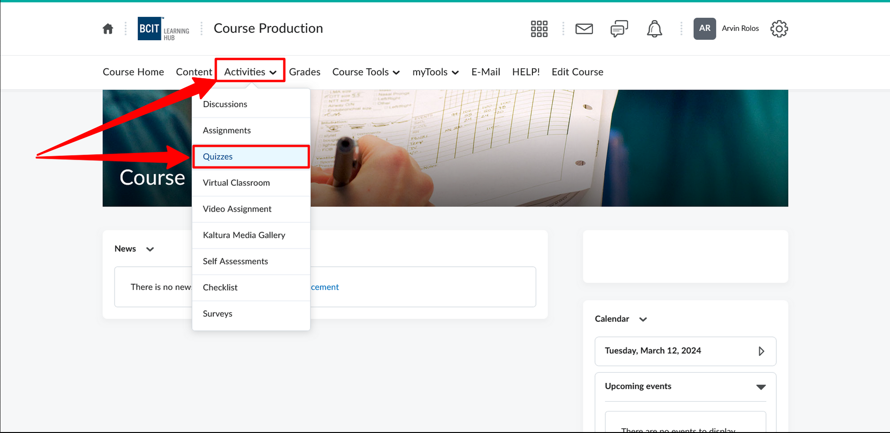
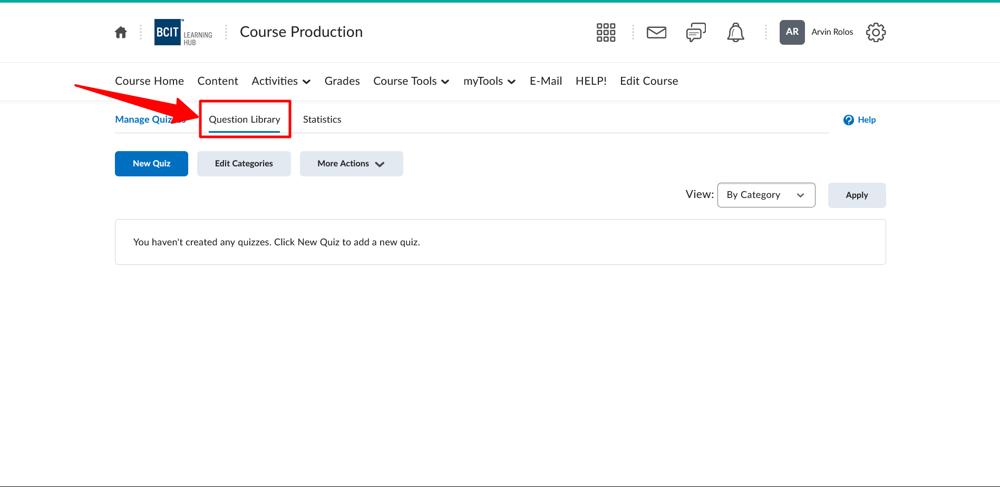
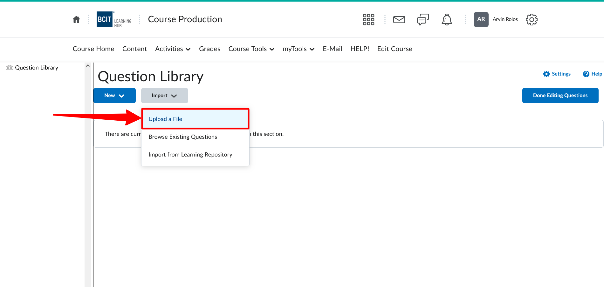
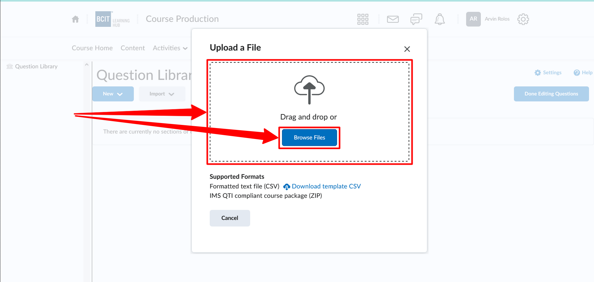
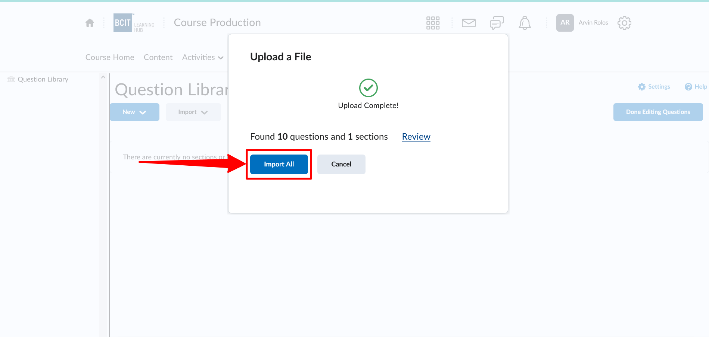
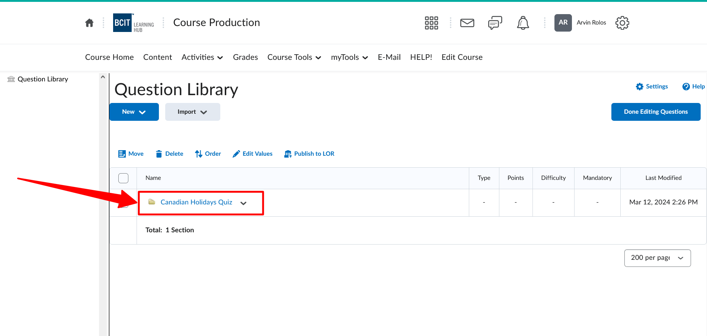
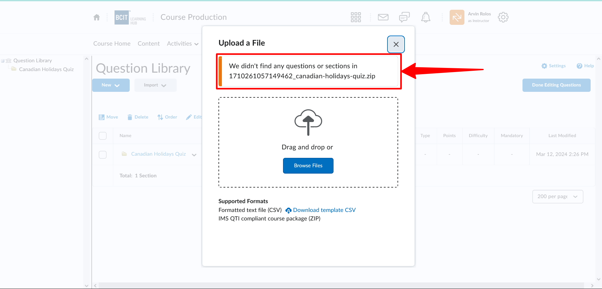

# The Qcon Process

*Qcon converts a Word document into a package file that can be imported into your Learning Management System (LMS) question library.*

<!--
## Retrieve from LMS

To be added

## Publish to LMS
-->

## Conversion Process

The conversion process is a series of steps that Qcon takes to convert your Word document into a package file that can be imported into your LMS. The process is automatic and takes a few minutes to complete.

???- "Step 1: Create a document of questions using Word"

    1. The questions should have numerical numbering
    1. The first question must be numbered "1." or "1)"
???- "Step 2: Upload your Word file to Qcon"

    1. Select your Word file from your computer
    1. Click the **Upload** button
???- "Step 3: Preview your questions"

    1. Qcon will display a preview of your questions
    1. Review the questions to ensure they are correct
    1. If you need to make changes, re-upload your Word file and repeat the process
???- "Step 4: Download your ZIP file"

    1. Click the **Next** button
    1. Follow the instructions how to upload the ZIP file in your LMS
    1. Click the **Download ZIP file** button

## Uploading the course package ZIP file to Learning Hub
!!! note "Uploading the ZIP file to Learning Hub"

    After downloading the ZIP file, you can upload it into your course in Learning Hub.

    === "Upload ZIP file to Learning Hub"
        1. Navigate to your course offering in Learning Hub
        1. Navigate to the **Quizzes**
            
        1. Click into the **Question Library**
            
        1. Click the **Import** button and the **Upload a File** link; follow the instructions to upload your ZIP file
            
            
            
        1. Verify that your questions were imported successfully into a **Section** with the same name as your file
            

???- failure "Failed to upload ZIP file to Learning Hub"
    === "Failed File Upload"
        If you encounter any errors during the uploading process, please contact us at [courseproduction@bcit.ca](mailto:courseproduction@bcit.ca) for assistance.
        

## Creating Quiz in Learning Hub

!!! info "Creating quiz in Learning Hub"
    Please check the ETS Tech Help guides below:

    - [Quizzes – Overview](https://www.techhelpbcit.ca/quizzes-overview/)
    - [Quizzes – Video tutorials for Instructors – Quiz tool](https://www.techhelpbcit.ca/video-tutorials-for-instructors-quiz-tool/)
    - [Quizzes – Create a Question Pool (Random Section) in a Quiz](https://www.techhelpbcit.ca/how-to-create-a-question-pool-random-section-in-a-quiz-new-quiz-experience/)

    You can browse [https://www.techhelpbcit.ca/category/instructor-resources/quiz-instructor/](https://www.techhelpbcit.ca/category/instructor-resources/quiz-instructor/) for more information about quizzes in Learning Hub.

## Errors during the process

There are three main categories of errors that can occur during conversion 

1. **Word document errors**
1. **Question formatting errors** [(example)](./assets/demo_process/canadian-holidays-quiz_question_format.docx) 
1. **System errors**.

The first pass over the document is to check for **Word document errors**. If any are found, the conversion process will stop and you will be notified of the errors. You will need to correct the errors in your Word document and re-upload it to Qcon.

If no **Word document errors** are found, the conversion process will continue to the question formatting check. If any **Question formatting errors** are found, the conversion process will stop and you will be notified of the errors. You will need to correct the errors in your Word document and re-upload it to Qcon.

!!! warning "Word document errors"
    
    Word document errors are related to the word document. These errors can include:

    - Incorrect file format
    - Missing content
    - Incorrect question numbering (only numerical numbering supported)

    If any Word document errors are found, the conversion process will stop and you will be notified of the errors. You will need to correct the errors in your Word document and re-upload it to Qcon.

    An important requirement to note is that the first question must be numbered "1." or "1)" . Otherwise Qcon will not be able to find content.

    
!!! warning "Question formatting errors"

    Question formatting errors are relating to the content of the questions in your Word document. These errors can include:

    - Missing question text
    - Missing answer choices
    - Missing correct answer

    If any question formatting errors are found, these will be displayed in the preview of your questions. You will need to correct the errors in your Word document and re-upload it to Qcon. check the qcon-guide for more information about the question type that shows the error.

<!-- 
    === "Canvas"

        To be added

    === "Moodle"

        To be added -->
